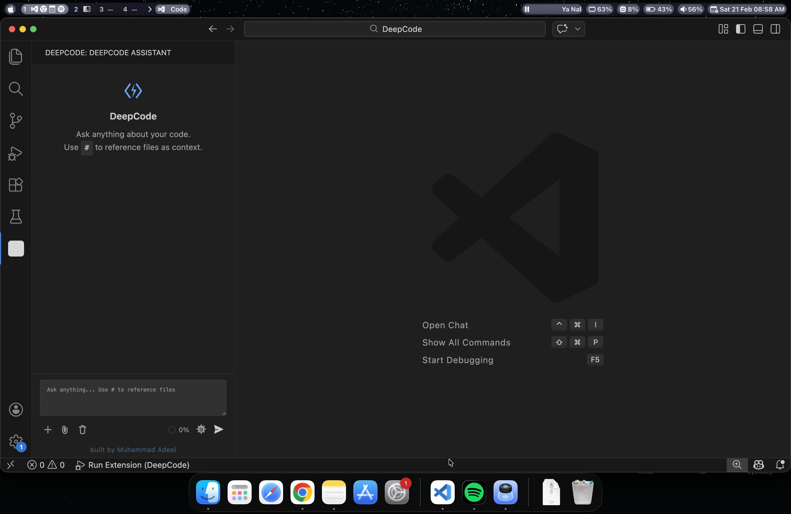
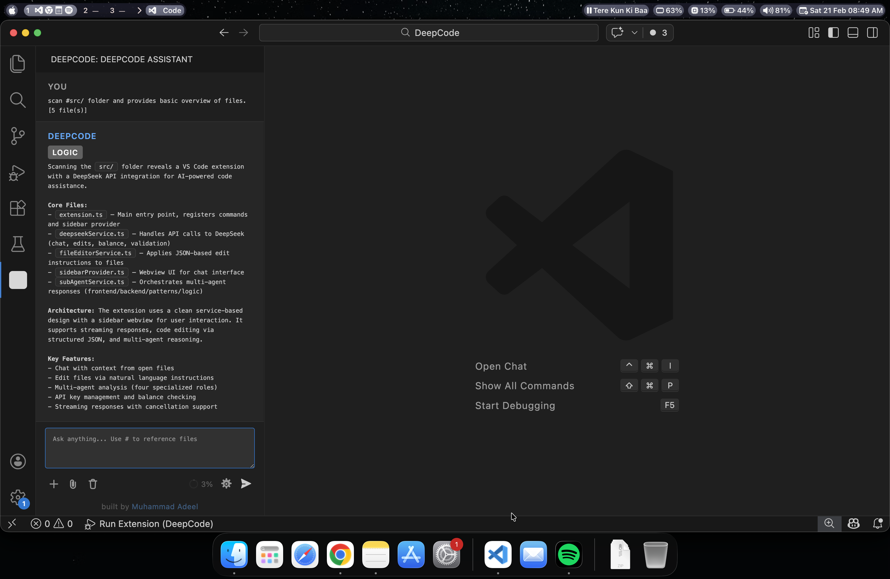
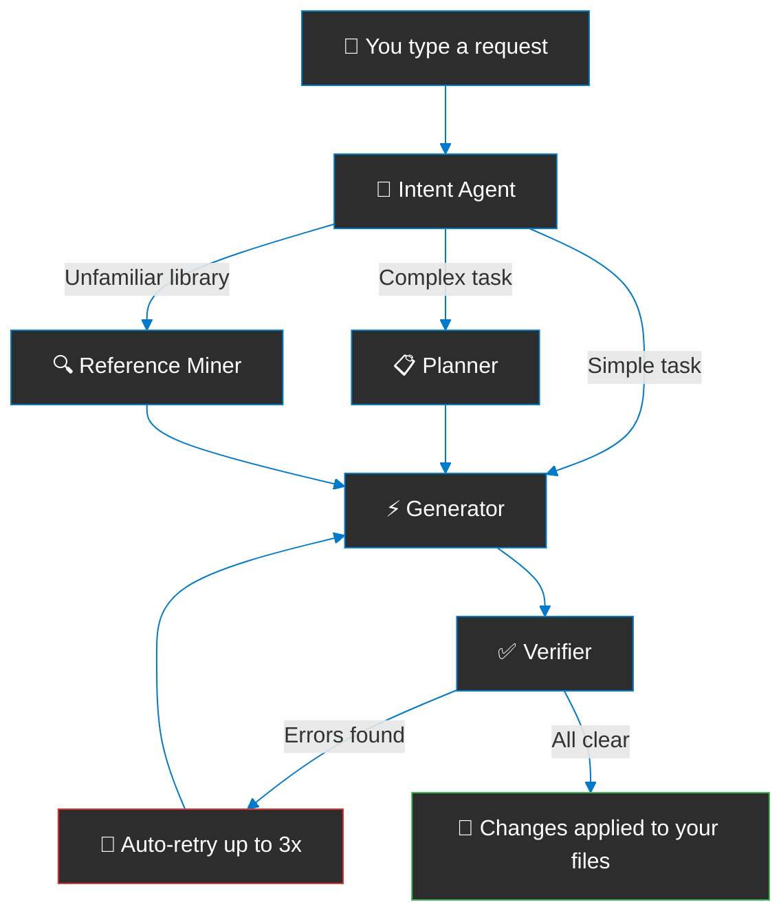
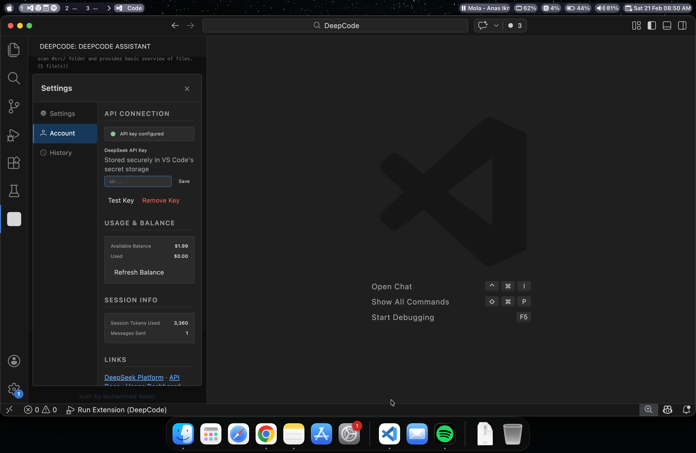

# DeepCode

Your AI coding assistant that lives inside VS Code. Ask it to edit files, explain code, fix bugs, or build entire features — it reads your project, understands the structure, and makes changes for you.

Powered by DeepSeek.



---

## What Can It Do?

- **Chat** — Ask questions about your code and get instant answers
- **Edit** — Select code, tell it what to change, and it applies the edit
- **Explain** — Highlight anything confusing and ask "what does this do?"
- **Refactor** — Tell it to clean up, rename, or restructure your code
- **Fix** — Right-click on broken code and let it figure out the fix
- **Search** — Find functions, references, and patterns across your whole project
- **Build features** — Describe what you want and it plans, writes, and verifies the code



---

## How It Works



Behind the scenes, DeepCode:

1. **Understands your request** — figures out what you want and which files are involved
2. **Plans the approach** — for bigger tasks, it decides the order of changes and any risks
3. **Looks up examples** — if you're using a library it hasn't seen, it searches GitHub for real-world usage
4. **Writes the code** — makes edits across as many files as needed
5. **Checks its own work** — runs your compiler/linter and fixes any errors automatically
6. **Applies the result** — only after everything passes

---

## Getting Started

1. Install the extension (see [Install](#install) below)
2. Click the **DeepCode** icon in the sidebar
3. Enter your DeepSeek API key when prompted
4. Start chatting!



### Keyboard Shortcut

Select code and press **⌘⇧E** (Mac) or **Ctrl+Shift+E** (Windows/Linux) to start an AI edit.

### Right-Click Menu

Select any code → right-click → choose:
- **Edit with AI**
- **Explain Code**
- **Refactor Code**
- **Fix Code**

---

## Install

### From VSIX

```bash
code --install-extension deepcode-1.0.0.vsix
```

### Build It Yourself

```bash
git clone https://github.com/Chaudhary-Adeel/deepcode.git
cd deepcode
chmod +x build.sh
./build.sh
code --install-extension deepcode-1.0.0.vsix
```

---

## Settings

Open VS Code settings and search for "DeepCode" to configure:

| Setting | What it does |
|---|---|
| **Model** | Choose between fast mode or thinking mode |
| **Temperature** | How creative the responses are (0 = precise, higher = creative) |
| **Auto Save** | Automatically save files after AI edits |
| **Verify Command** | Command to check code after edits (e.g. your test suite) |

---

## Contributing

Contributions welcome! Fork the repo, make changes, and submit a PR.

```bash
npm install        # Install dependencies
npm run compile    # Build
npm test           # Run tests
npm run lint       # Check code style
```

See [Technical.md](Technical.md) for architecture details.

---

## License

MIT

## Author

**Muhammad Adeel** — [chaudhary1337@gmail.com](mailto:chaudhary1337@gmail.com)