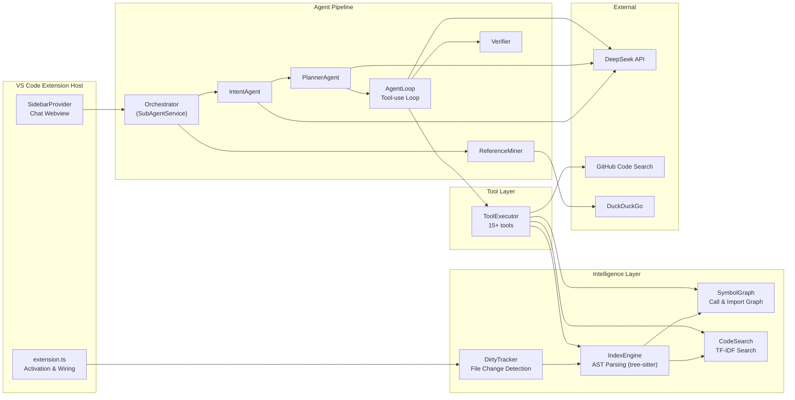
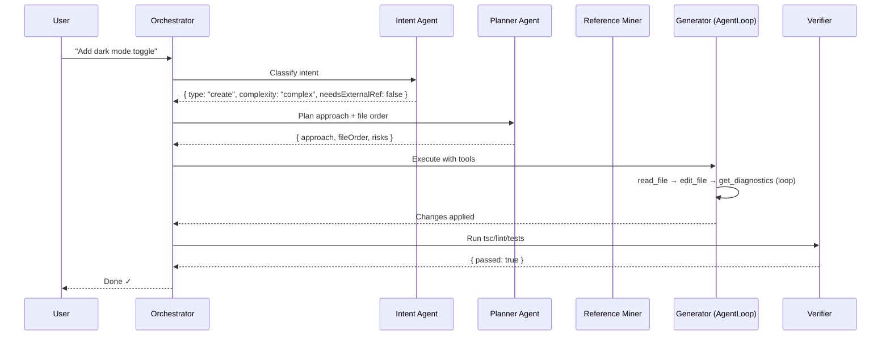
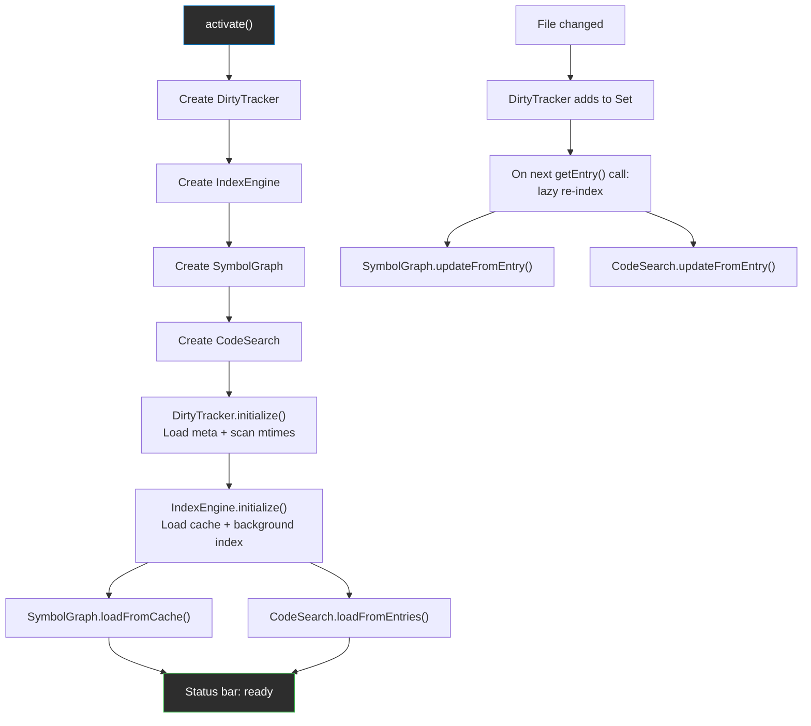

# DeepCode — Technical Architecture

> Deep dive into how DeepCode works under the hood.
> For user-facing docs, see [README.md](README.md).

---

## System Overview



---

## Module Architecture

### 1. Dirty Tracker (`dirtyTracker.ts`)

Tracks which files have changed since they were last indexed. Foundation for all incremental processing.

**How it works:**
- Maintains an in-memory `Set<string>` of dirty file paths — O(1) lookups
- On activation, compares every file's `mtime` against the last-indexed timestamp to pre-populate the dirty set
- Watches for file changes via VS Code's built-in `FileSystemWatcher` (not chokidar)
- On any file change: adds the path to the set — nothing else (zero-cost)
- Exports an `onDidChange` event so other modules react to dirty/clean transitions

**Persistence:** `.deepcode/index-meta.json` — stores `{ lastIndexed: timestamp }` per file. Debounced writes (2s).

**Ignored directories:** `node_modules`, `.git`, `out`, `dist`, `__pycache__`, `.deepcode`

---

### 2. Index Engine (`indexEngine.ts`)

Parses TypeScript/JavaScript files using tree-sitter and extracts structured data from the AST.

**How it works:**
- Uses **web-tree-sitter** (WASM) — grammar files bundled in `parsers/` directory
- Supports: `.ts`, `.tsx`, `.js`, `.jsx`, `.mts`, `.cts`, `.mjs`, `.cjs`
- `getEntry(filepath)` is the primary API — lazy indexing:
  1. Not dirty + cached → return cache (instant)
  2. Dirty → read file → hash check → if unchanged, skip parse
  3. Hash changed → full tree-sitter parse → extract symbols → update cache → mark clean
- Dependency propagation: if a file's exports change, all importers are marked dirty

**What it extracts per file (`IndexEntry`):**

| Field | Description |
|---|---|
| `symbols` | Functions, classes, interfaces, types, enums, variables with name, kind, line range, params, return type, async/static/exported flags, and **call expressions** |
| `imports` | Source module, specifiers, type-only flag |
| `exports` | Name, kind, line |
| `skeleton` | Signatures-only view (~10% of file size) — function/method bodies replaced with `{ ... }` |
| `contentHash` | SHA-256 prefix for change detection |

**Persistence:** `.deepcode/symbols.json`

**Background indexing:** On activation, indexes all dirty files in batches of 10 with event-loop yields. Reports progress via `onDidProgress`.

---

### 3. Symbol Graph (`symbolGraph.ts`)

A traversable graph of every symbol in the workspace with three types of edges.

**Data structures:**
- `symbolsByFQN: Map<string, GraphSymbol>` — primary index using fully-qualified names (`filepath#symbolName`)
- `symbolsByName: Map<string, Set<string>>` — name → FQNs (handles duplicates across files)
- `symbolsByFile: Map<string, Set<string>>` — file → all FQNs in that file
- `importEdges / reverseImports` — which files import from which
- `calleeEdges / callerEdges` — bidirectional call-graph

**Call-graph resolution:**
When a function calls another, the graph resolves the callee name to a known symbol using:
1. Same-file symbol (exact FQN match)
2. Imported symbol (from import specifiers)
3. Global fallback (if ≤3 matches by name to avoid false positives)

**Key queries:**
- `getSymbol(name)` — exact lookup
- `searchSymbols(query, limit)` — fuzzy search with exported-first ranking
- `getCallers(name)` — who calls this symbol?
- `getCallees(name)` — what does this symbol call?
- `getImporters(filepath)` — which files import from this file?
- `findReferences(name)` — all definitions, imports, and re-exports of a symbol

---

### 4. Code Search (`codeSearch.ts`)

Natural-language code search using TF-IDF over AST-chunked code. No external dependencies.

**How it works:**
- Chunks code by function/class boundaries using IndexEngine's symbol data
- Each chunk becomes a searchable document with tokenized content
- Builds an inverted index (`token → chunk IDs`) for fast lookup
- On query: tokenize → look up matching chunks → score by TF-IDF cosine similarity → rank

**Data structures:**
- `chunks: CodeChunk[]` — each has `id`, `filepath`, `symbolName`, `kind`, `tokens`, `preview`
- `invertedIndex: Map<string, Set<number>>` — for O(1) token-to-chunks lookup
- `idfCache: Map<string, number>` — precomputed inverse document frequency

**Design decisions:**
- JS/TS keywords are down-weighted (not removed) as stop words
- Minimum token length: 2 characters
- Persistence: `.deepcode/search-index.json` (file hashes for incremental updates)

---

### 5. Context Manager (`contextManager.ts`)

Assembles context for agent prompts and enforces token budgets.

**Three responsibilities:**

**a) Workspace Context (`ContextManager`)**
- Builds a snapshot: workspace name, root path, file tree (3 levels deep), active editor info, selected text
- Assembles user prompts from message + attached files + editor content + history

**b) Rolling Context (`RollingContext`)**
- Keeps the last 4 turns verbatim, summarizes older turns via a DeepSeek call
- Maintains a structured `operationLog: OperationEntry[]` (capped at 50 entries)
- Detects repeated failures: `hasRepeatedFailure(action, target)` — if the same action on the same target fails 3+ times, the orchestrator switches strategy

**c) Token Budget (`ContextBudget`)**
- Budget: 26,000 tokens (estimated at 4 chars/token)
- Protected content: system prompt + last 3 history turns (never dropped)
- Drop order when over budget:
  1. File skeletons
  2. Oldest tool results
  3. Compress conversation summary
  4. Older history turns
- Returns `BudgetResult` with a `dropped[]` list for observability

---

### 6. Agent Pipeline

The orchestrator (`SubAgentService`) routes every request through a multi-agent pipeline:



**Intent Agent** — Single DeepSeek call that classifies the request:
- Output: `{ taskType, filesInScope, clarifiedTask, complexity, needsExternalRef }`
- Task types: `question`, `edit`, `refactor`, `debug`, `create`, `explain`
- Complexity: `simple`, `moderate`, `complex`

**Planner Agent** — Produces an execution plan for complex tasks:
- Output: `{ approach, fileOrder, pattern, risks }`
- Instructs "edit leaf modules before higher-level ones"
- Identifies design patterns (observer, factory, middleware, etc.)

**Reference Miner** — Searches for real-world code examples when working with unfamiliar libraries:
- Searches DuckDuckGo for each library/API in parallel
- Feeds combined results to DeepSeek to synthesize an implementation guide with API signatures, code examples, and pitfalls

**Generator (AgentLoop)** — The core tool-use loop:
- Iterative: call DeepSeek with tool definitions → execute tool calls in parallel → loop until the model produces a final text answer
- Supports parallel tool dispatch via `Promise.all`
- Can spawn sub-agents for focused investigation (with recursion guard)
- Max 8 iterations per run
- Retries API failures with exponential backoff (up to 3 retries)
- Streams tokens on iterations > 1 via `onToken` callback

**Verifier** — Checks the generator's work:
- Runs the configured verify command (default: `npx tsc --noEmit`)
- On failure: searches the web for the error message → asks DeepSeek for a fix → retries
- Max 3 retry cycles
- Timeout: 60 seconds per execution

---

### 7. Tool Layer (`tools.ts`)

15 tools available to agents, sandboxed to the workspace directory:

| Tool | Purpose |
|---|---|
| `read_file` | Read file contents with optional line ranges. Triggers lazy re-indexing. |
| `write_file` | Create or overwrite files (auto-creates directories) |
| `edit_file` | Surgical find-and-replace edits |
| `multi_edit_files` | Batch edits across multiple files |
| `list_directory` | List directory contents (flat or recursive) |
| `search_files` | Glob-based file search |
| `grep_search` | Text/regex search across files |
| `search_symbol` | AST-powered symbol lookup via SymbolGraph |
| `find_references` | Structural reference finding (definitions, imports, re-exports) |
| `get_file_skeleton` | Signatures-only view of files (~10% size) |
| `semantic_search` | Natural language code search via TF-IDF |
| `run_command` | Execute shell commands |
| `run_verify` | Run verification command with error parsing |
| `web_search` | DuckDuckGo search |
| `fetch_webpage` | Fetch and extract text from URLs |
| `search_external_references` | GitHub Code Search API for real-world examples |
| `get_diagnostics` | VS Code errors/warnings |
| `run_subagent` | Spawn sub-agents (disabled for sub-agents to prevent recursion) |

**Security:** All file operations are sandboxed — paths must resolve within the workspace root.

---

### 8. DeepSeek Integration (`deepseekService.ts`)

- Direct HTTPS calls to `api.deepseek.com` using Node.js `https` module (no SDK)
- Supports both streaming and non-streaming responses
- Models: `deepseek-chat` (fast) and `deepseek-reasoner` (chain-of-thought)
- Configurable: temperature, top-p, max tokens, frequency/presence penalty
- API key stored in VS Code's `SecretStorage` (never in plain text)

---

### 9. Persistence

All persistent data lives in `.deepcode/` at the workspace root:

| File | Format | Contents |
|---|---|---|
| `index-meta.json` | JSON | Per-file `lastIndexed` timestamps |
| `symbols.json` | JSON | Full index cache (symbols, imports, exports, skeletons per file) |
| `search-index.json` | JSON | TF-IDF file hashes for incremental updates |
| `memory.json` | JSON | Interaction history, key file entries, project context |

---

### 10. Extension Lifecycle



---

### 11. Build & Test

```bash
npm install                # Install dependencies
npm run compile            # TypeScript → out/
npm test                   # Jest test suite
npm run test:coverage      # Jest with coverage report
npm run lint               # ESLint (flat config, v10)
./build.sh                 # Full build + VSIX packaging
```

**Test setup:**
- Framework: Jest with ts-jest
- VS Code mock: `src/__tests__/__mocks__/vscode.ts` — stubs workspace, window, URI, EventEmitter, etc.
- Config: `jest.config.js` — ts-jest preset, node environment, auto-mapped vscode mock

**Lint setup:**
- ESLint v10 flat config (`eslint.config.js`)
- TypeScript-ESLint with project-aware type checking
- Relaxed rules for existing codebase (warnings on `any`, unused vars)

---

### 12. Dependencies

| Package | Purpose |
|---|---|
| `web-tree-sitter` | WASM-based AST parsing for TS/JS |
| `typescript` | TypeScript compiler (dev) |
| `jest` / `ts-jest` / `@types/jest` | Test framework (dev) |
| `eslint` / `typescript-eslint` | Linting (dev) |
| `@types/vscode` | VS Code API types (dev) |

No runtime dependencies beyond `web-tree-sitter`. All HTTP calls use Node.js built-in `https`.
